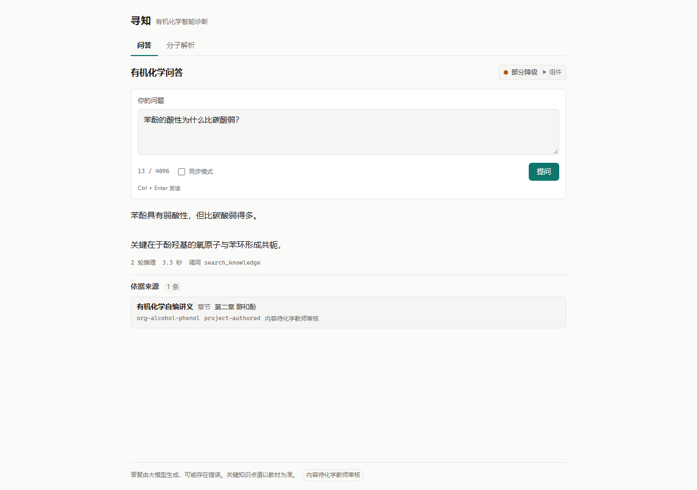
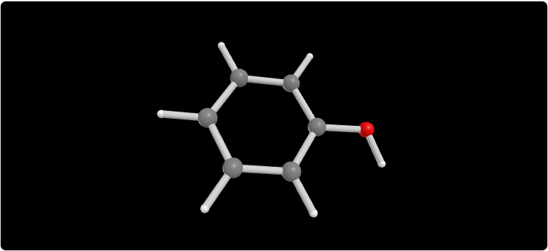

# 学智有机 | Xuezhi-OrganicAgent

<div align="center">

### 面向高中有机化学的 AI 学习助手

**让答案有依据，让分子看得见，让化学讲得明白。**

华为 ModelArts MaaS 盘古 · RAG 知识检索 · RDKit · Three.js · Edge-TTS · Fay（可选）

[快速开始](#快速开始) · [功能一览](#功能一览) · [项目文档](#项目文档)

</div>

---

学智有机是一个面向高中有机化学学习场景的开源教学智能体原型。它将知识检索、AI 问答、分子结构解析和交互式可视化整合在一个 Web 应用中，帮助学习者理解答案背后的知识与结构，而不止得到一个结论。

> 本项目参加华为创新赛教育赛道。当前定位为教学演示与持续验证中的原型，能力范围和已知限制见下文。

## 功能一览

| 能力 | 说明 |
| --- | --- |
| **有机化学问答** | 通过 Agent 编排模型与知识检索，围绕高中有机化学问题生成解释 |
| **知识来源** | 检索项目自编高中有机化学讲义，并在可用时展示来源信息 |
| **分子解析** | 输入 SMILES，使用 RDKit 解析结构及支持的分子属性 |
| **交互式 3D** | 在浏览器中查看并旋转分子结构 |
| **语音讲解** | 使用 Edge-TTS 合成语音；可选连接 Fay 推送讲解文本 |
| **流式问答** | 提供 SSE 问答接口，发送处理阶段事件与结果 |

## 界面预览

| 有机化学问答与来源 | 分子结构可视化 |
| --- | --- |
|  |  |

## 架构概览

```text
浏览器（Vue 3）
      │ HTTP / SSE
      ▼
FastAPI API
      │
      ├── Agent ── 华为 ModelArts MaaS（openPangu）
      │         └── RAG ── ChromaDB + 中文嵌入模型
      ├── 化学工具 ── RDKit
      └── 语音服务 ── Edge-TTS ── Fay（可选）

前端使用 Three.js 展示后端生成的分子结构数据
```

## 技术栈

- **前端：** Vue 3、TypeScript、Vite、Three.js
- **API 与 Agent：** Python 3.12、FastAPI、MCP 工具调度
- **模型：** 华为 ModelArts MaaS OpenAI 兼容 API（默认模型 `openpangu-2.0-flash`）
- **检索：** ChromaDB、`BAAI/bge-small-zh` 嵌入模型
- **化学计算：** RDKit
- **语音与数字人：** Edge-TTS；Fay 可选
- **演示环境：** Docker Compose

## 快速开始

### 前置条件

- Docker Desktop（Linux 容器后端）及 Docker Compose
- 可访问华为 ModelArts MaaS 的 API Key

首次启动需要准备项目使用的后端镜像 `xuezhi-chem-test`。在仓库根目录执行：

```bash
docker build -f backend/tests/Dockerfile.test -t xuezhi-chem-test .
```

然后创建本地配置并启动服务：

```bash
cp .env.example .env
# 编辑 .env，设置 MAAS_API_KEY
docker compose up -d
```

Windows PowerShell 可使用：

```powershell
Copy-Item .env.example .env
```

启动后访问：

| 地址 | 用途 |
| --- | --- |
| http://127.0.0.1:5173 | Web 应用 |
| http://127.0.0.1:8000/health | 服务与组件健康状态 |
| http://127.0.0.1:8000/docs | API 文档 |

停止服务：`docker compose down`

> `.env` 中的密钥仅保存在本地，请勿提交。Fay 服务默认关闭；语音使用 Edge-TTS，依赖外网服务。

## 仓库结构

```text
.
├── backend/
│   ├── app/          API、Agent、化学引擎、知识检索、模型与语音模块
│   └── tests/        后端测试与测试镜像定义
├── frontend/
│   ├── src/          Vue 应用、问答与分子可视化界面
│   ├── tests/        前端单元测试
│   └── e2e/          浏览器走查与截图
├── data/             项目知识语料与本地运行数据
├── docs/             架构、运行指南、验证记录与决策文档
├── scripts/          本地开发与维护脚本
├── docker-compose.yml
└── .env.example
```

## 验证与质量

- 前端：166 项测试通过
- 后端：752 项测试通过，40 项跳过，0 项失败
- 检索评测：top-1 为 27/33（81.8%），top-3 为 32/33（96.97%）

> 检索评测集由项目组整理，样本量有限且尚未经化学教师审核；结果仅作当前工程验证参考，不代表教学效果或答案正确率保证。测试数据可能随代码变更而更新。

## 当前范围与限制

- 输入以文本和 SMILES 为主；**不支持图片、手写公式或试卷识别**。
- 知识库目前是项目自编讲义（41 条、21 个主题），不是教材原文，内容仍待化学教师审核。
- RDKit 负责结构解析与支持的属性计算；SMILES 可解析不代表反应机理已被验证。
- Fay 默认不启动；当前集成不提供真实音素级口型同步。语音使用 Edge-TTS，不能视为离线 TTS。
- Docker Compose 使用本地测试镜像，属于演示/开发配置，不是开箱即用的生产部署方案。部署华为云 ModelArts / AgentArts 需按目标平台另行适配验证。

## 项目文档

- [文档总览](docs/README.md)
- [产品范围与验收标准](docs/product-scope.md)
- [系统架构与组件职责](docs/architecture.md)
- [本机运行指南](docs/local-run-guide.md)
- [部署与运维手册](docs/deployment-operations.md)
- [开发流程与分支规范](docs/development-workflow.md)

## 参与贡献

欢迎通过 Issue 讨论问题、提交改进建议或贡献代码。开始开发前，请阅读[开发流程与分支规范](docs/development-workflow.md)，并优先查看产品范围和架构文档，确保实现与当前能力边界一致。

## 许可证与使用

本项目用于创新竞赛、教育科研演示与非商业用途。项目集成的第三方组件分别遵循其自身许可证；使用、修改或部署前请查看对应项目的许可证与服务条款。Fay 采用 GPL-3.0，具体使用合规性请结合实际分发和部署方式评估。

---

<div align="center">

**学智有机：让高中有机化学的答案可追溯、结构可视化、讲解更清晰。**

</div>
